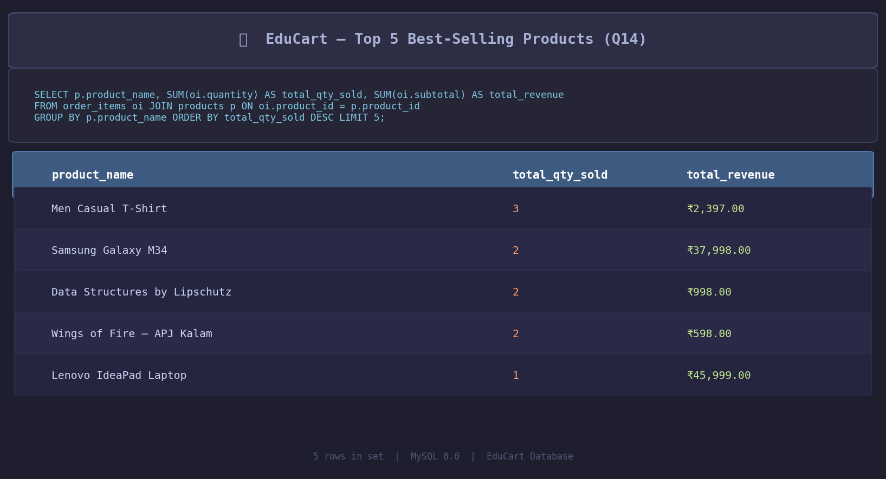
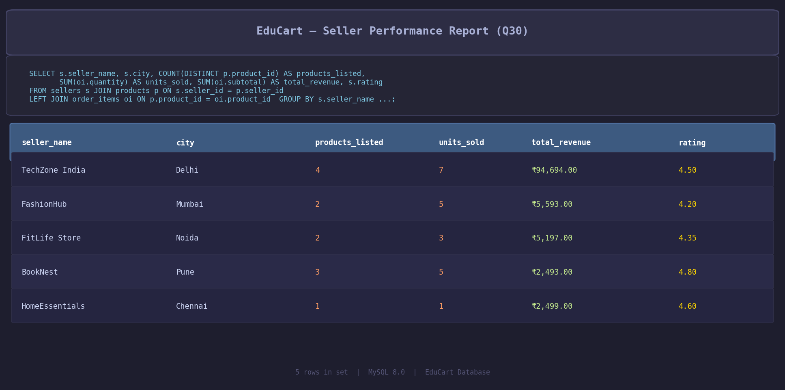

# EduCart – E-Commerce Order Management System

A MySQL project simulating a real-world e-commerce backend with orders, products, sellers, payments and reviews.

---

## Database Schema

8 tables with proper relationships:

```
customers → orders → order_items → products → categories
                ↓                      ↓
           payments               sellers
               reviews ← customers + products
```

## Files

| File | Description |
|------|-------------|
| `EduCart_Ecommerce.sql` | Full SQL — schema, data, queries |
| `screenshot1.png` | Best-selling products query output |
| `screenshot2.png` | Seller performance report output |

## What's Covered

- **Schema** — 8 tables, foreign keys, constraints, ENUM, GENERATED columns
- **30 Queries** — Basic → JOINs → Aggregates → Subqueries → Window Functions
- **2 Views** — `vw_order_summary`, `vw_product_performance`
- **1 Stored Procedure** — `GetCustomerOrders(customer_id)`
- **1 Trigger** — Auto stock reduction on order insert

## Key Insights

- TechZone India leads with ₹94,694 in total revenue across 4 products
- UPI is the most used payment method
- Electronics is the highest revenue category
- 3 orders are still pending payment — refund/follow-up needed
- BookNest has the highest seller rating (4.80) despite lower revenue

## How to Run

1. Open **MySQL Workbench**
2. Open `EduCart_Ecommerce.sql`
3. Run all — database, tables, data and queries execute in order

## Screenshots




---

**Author:** Sameer | BCA Student | Uttar Pradesh, India
**Tools:** MySQL 8.0 · MySQL Workbench
